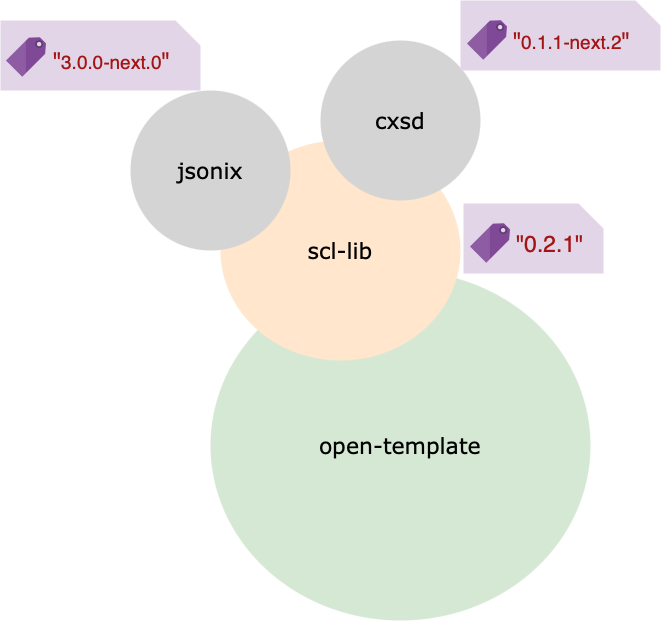
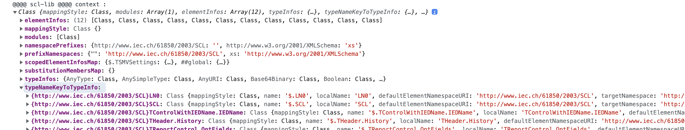
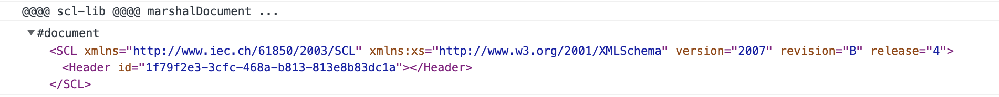

# LibWorkspace

This project was generated with [Angular CLI](https://github.com/angular/angular-cli) version 14.1.3.

scl-lib
====

#### Library for IEC 61850 standard

[](https://github.com/romdhanisam/open-template/blob/main/LICENSE)
[](https://www.npmjs.com/package/@opentemplate/scl-lib)
[](https://codecov.io/github/romdhanisam/open-template?branch=main)
[](https://sonarcloud.io/summary/new_code?id=lib-opentemplate%3A%40opentemplate%2Fscl-lib)
<!-- [](https://app.fossa.com/projects/git%2Bgithub.com%2Fromdhanisam%2Flib?ref=badge_shield) -->

## Usage

### Install:
```
npm i @opentemplate/scl-lib
```


##### Context


##### Usage
You can import the library files from TypeScript:

```TypeScript
import { ScllibService, _SCLType } from '@opentemplate/scl-lib';
```
##### Example
* Marshal Document use case
```TypeScript
const namespaces: any = {
  namespacePrefixes: {
    "http://www.iec.ch/61850/2003/SCL": "",
    "http://www.w3.org/2001/XMLSchema": "xs"
  },
  mappingStyle : "simplified"
};
...
constructor(private scllibService: ScllibService) {
    this.scllibService.setContext(namespaces);
}
...
const scl: _SCLType = {
  release: 4,
  revision: "B",
  version: "2007",
  header: {
    id: uuid.v4()
  },
};
...
this.scllibService.marshalDocument({SCL: scl})
```

---- 
### API Reference:
### [Jsonix](https://github.com/highsource/jsonix)
* Jsonix (JSON interfaces for XML) is a JavaScript library which allows you to convert between XML and JSON structures.
* With Jsonix you can parse XML into JSON (this process is called _unmarshalling_) or serialize JSON in XML form (this is called _marshalling_).
* These conversions are based on declarative XML/JSON mappings which can be written manually or generated from an XML Schema.

Jsonix advantages:

* Strongly structured
* Type-safe
* Bidirectional
* (Optionally) XML Schema-driven

### [cxsd](https://www.npmjs.com/package/cxsd)

* cxsd is a streaming XSD parser and XML parser generator for Node.js and
  (optionally but highly recommended) [TypeScript](http://www.typescriptlang.org/).
  It automatically downloads all referenced `.xsd` files and outputs two files for each defined namespace:
  - `.js` JavaScript code for Node.js containing a compact state machine table for the [cxml](https://github.com/charto/cxml) parser.
  - `.d.ts` TypeScript definition with JSDoc comments to help editors with tab completion, type verification and tooltips.

---
### Supported Versions

Information about supported @opentempl/scl-lib versions.

| Version               | Supported             |  Scope        |
| -------               | ------------------    | -------       |
| <= 0.1.24              | :x:                   | opentempl     |
| > 0.1.24 & <= 0.1.32   | :white_check_mark:    | opentempl     |

We published 0.2.0 to npm as @opentemplate/scl-lib and will continue to publish updates there.

| Version               | Supported             |  Scope        |
| -------               | ------------------    | -------       |
| >= 0.2.0               | :white_check_mark:    | opentemplate  |
